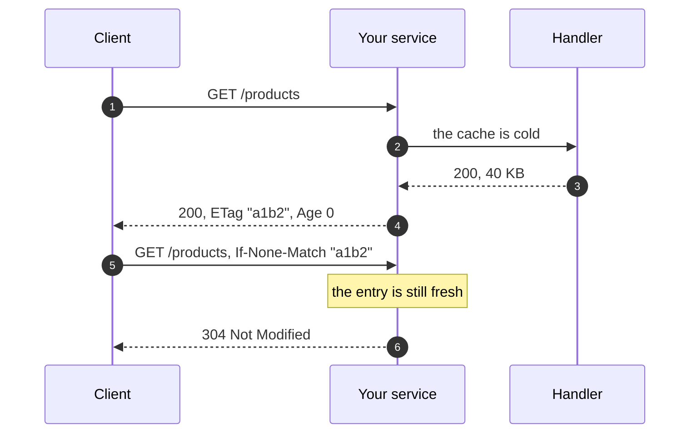

# Response Cache

A catalog endpoint reads the same rows for every caller and answers the same
bytes every time. Under load it runs that query thousands of times a minute,
and every replica runs its own copy.

`@cached` is not the answer. It caches what a function returns, and what a
route answers is not that: the framework still has to serialize it, and a
header the handler set is not part of the return value. Cache the response.

```python
--8<-- "http/cache.py"
```

Declare it on the route and the second caller is answered without reaching
the handler. It rides the registered [Cache](../cache/index.md), so a
response one replica computed answers the callers of every other one.

`CachedResponse` is declared rather than called, because the middleware has
to answer before the app is routed, and a handler body runs long after that.
It is the same shape as [`Conditional`](conditional.md): the component holds
the rules every route shares, and the route says it wants them.

## What a hit looks like

A hit carries `Age`, which says how many seconds it has been in the store.
That is the standard header a cache answers with, so a client, a CDN, and a
proxy all read it without knowing anything about grelmicro.

Every stored response carries an `ETag`. When the client already holds it and
sends `If-None-Match`, the answer is `304 Not Modified` with no body at all:



The handler ran once. The second request cost a cache read and 100 bytes on
the wire.

## One cold key runs the handler once

The moment an entry expires, every request for it misses at the same time. A
plain cache answers that by running the handler once per caller, which is the
load spike the cache was there to prevent.

Here the first request runs the handler and every other one waits for it, in
the process and across replicas when a
[Coordination](../coordination/index.md) backend is configured. It is the same
stampede protection [`TTLCache`](../cache/index.md) already gives `@cached`.

A request's own `Cache-Control` is not read. This answers for the resource
rather than for one caller, so honouring `no-cache` from an unauthenticated
caller would let anybody spend the handler at will.

A path whose responses are never storable, a stream above all, stops taking
the lock once the first one has shown that nothing is kept for it, so it is
never queued behind itself. A `HEAD` takes it never: it reads what a `GET`
stored and fills nothing, so folding it would hold up the read it shares a
key with.

## What is never stored

A response cache is dangerous in exactly one way: answering one caller with
another caller's response. These rules are not configurable, because every one
of them is that mistake.

| Not stored | Why |
|---|---|
| A request carrying `Authorization` or `Cookie` | it was answered for one caller |
| A response carrying `Set-Cookie` | it is one caller's session |
| A response carrying `Cache-Control: no-store`, `no-cache` or `private` | it said so |
| A response carrying `Cache-Control: max-age=0` or `s-maxage=0` | it is stale already |
| Anything but `200` | a failure is not an answer to hand on |
| A response carrying `Content-Encoding` | compression sits outside this middleware |
| A `HEAD` response | its body is empty, and would answer the `GET` after it with nothing |

A `HEAD` still reads what a `GET` stored, and is answered with the same
headers and no body.

Only `GET` is cached. `CachedResponse()` on a route that answers anything
else is refused when `micro.install(app)` reads it, naming the path.

## Vary

`Vary` is where naive response caches leak. A response that says
`Vary: Accept-Language` is only an answer to a client that asked for the same
language, and a cache that stores it under the URL alone will hand the French
page to the next caller who wanted German.

Declare what the key reads:

```python
CachedResponses(vary_by_headers=("accept-language",))
```

A response whose own `Vary` names a header outside that set is not stored, and
the refusal is logged. So a handler that starts varying on something new stops
being cached rather than starting to answer the wrong callers.

What the key reads is written into the stored response's `Vary`, joined with
whatever the handler set. The cache in front of yours has to be told too: a
CDN, a corporate proxy, or the browser would otherwise hand one caller's copy
to the next one who sent a different value.

`Vary: *` is never stored.

A response naming its own freshness is kept no longer than it says.
`Cache-Control: max-age=30` caps the entry at 30 seconds whatever the TTL is,
and `s-maxage` wins over `max-age` where both are named, because it is the
one written for a shared cache.

Every occurrence of a header counts. A response carrying two `Vary` lines, or
two `Cache-Control` lines, says all of what they say, and reading only the
last of them is how the one that refused the store goes missing.

## The key

By default the key is the scheme, the host, the prefix the app is served
under, the path, and the whole query string, in one order whatever order the
client sent it in, plus the value of every header named in `vary_by_headers`.
The host and the prefix are in it so an app answering for two hostnames, and
two services behind one gateway sharing one store, never hand out each other's
responses.

Name the parameters that matter and the rest is ignored, so a tracking
parameter does not turn one resource into a thousand:

```python
CachedResponses(vary_by_query=("page", "size"))
```

`key=` replaces the whole thing. It takes the ASGI scope and returns the key,
or `None` to leave that request uncached.

!!! warning "Keying on the caller"
    The scope carries the client address, and building it into the key turns a
    shared cache into a per-caller one: the hit rate collapses, the store grows
    with the number of callers, and a mistake in the key answers one of them
    with another one's response. A per-user result belongs in
    [`@cached`](../cache/cached.md), on the data rather than the response.

## Naming paths instead of routes

`CachedResponse()` is a FastAPI dependency, on a route or on the whole router
it is included with:

```python
app.include_router(products, dependencies=[CachedResponse(ttl=60)])
```

Starlette and Litestar resolve no dependencies to hang it on, and a router you
did not write cannot be changed either, so name the URLs and how long each is
kept:

```python
--8<-- "http/cache_paths.py"
```

Exact match, unless the pattern ends with `*`, which matches as a prefix. It
is the matching every grelmicro middleware uses, the same as
`ConditionalRequests(include=...)`. The most specific pattern decides, so
`{"/products/*": 60, "/products/hot": 300}` keeps the hot one for 300
seconds.

`exclude=` carves a path out again, whatever a route or a pattern says.

## Invalidating

The TTL is the floor, not the only lever. A write that changes what a read
answers drops what the cache would otherwise go on serving:

```python
@app.post("/products")
async def create(product: ProductIn) -> Product:
    created = await save(product)
    await cached_responses.purge()
    return created
```

`purge()` deletes every response that component stored, and nothing else in
the cache, because each entry carries its tag.

## When the store is down

A cache that cannot be reached is a cache miss. A read that fails is logged
and answered by the handler, and a response that cannot be written still goes
out to the caller who waited for it. Adding the cache never makes a path less
available than it was without it.

## Where it sits

Register it before `ConditionalRequests()`, so a hit is answered without
entering it. Both are added inside whatever middleware the app itself
installed, so a request still passes middleware authentication before either
can answer.

!!! warning "A hit answers before the app is routed"
    A route's own `Depends` never runs on a hit, because the response is
    already on its way back by then. `CachedResponse()` on a route gated by a
    security scheme, an `APIKeyHeader` or an `HTTPBearer`, is refused when
    `micro.install(app)` reads it, naming the path.

    A gate that is a plain `Depends` reading a header of its own cannot be
    seen from here. Do not declare `CachedResponse()` on a route like that:
    cache what answers everybody the same, and use
    [`@cached`](../cache/cached.md) on the data behind the ones that do not.

## Options

Every option of `CachedResponsesMiddleware` is taken by `CachedResponses` and
forwarded, so a registered component and a hand-added middleware answer the
same.

| Option | What it does |
|---|---|
| `ttl` | seconds a response is kept when its route names none |
| `paths` | path patterns and the seconds each is cached for |
| `exclude` | paths never cached, whatever else says |
| `vary_by_headers` | request headers the key reads |
| `vary_by_query` | query parameters the key reads |
| `key` | builds the key itself |
| `skip` | leaves one response unstored |
| `max_body_size` | largest body stored, 1 MB by default |
| `cache` | the `TTLCache` to store in |
| `namespace`, `name` | keep two sets of rules apart on one app |
