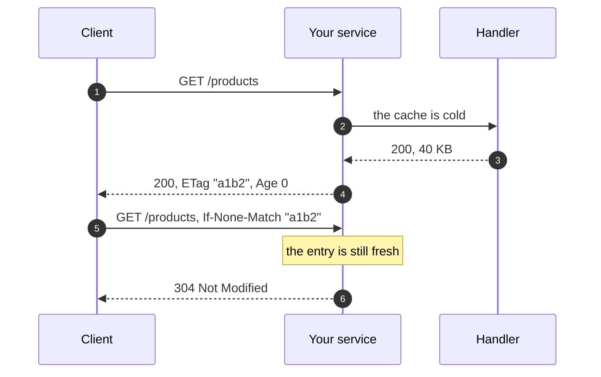

# Response Cache

A catalog endpoint reads the same rows for every caller and answers the same
bytes every time. Under load it runs that query thousands of times a minute,
and every replica runs its own copy.

`@cached` is not the answer. It caches what a function returns, and what a
route answers is not that: the framework still has to serialize it, and a
header the handler set is not part of the return value. Cache the response.

```python
--8<-- "http/cache.py"
```

Declare it on the route and the second caller is answered without reaching
the handler. It rides the registered [Cache](../cache/index.md), so a
response one replica computed answers the callers of every other one.

`CachedResponse` is declared rather than called, because a hit is answered
before the handler runs.
It is the same shape as [`Conditional`](conditional.md): the component holds
the rules every route shares, and the route says it wants them.

## What a hit looks like

A hit carries `Age`, which says how many seconds it has been in the store.
That is the standard header a cache answers with, so a client, a CDN, and a
proxy all read it without knowing anything about grelmicro.

Every stored response carries an `ETag`. When the client already holds it and
sends `If-None-Match`, the answer is `304 Not Modified` with no body at all:


```mermaid
sequenceDiagram
    autonumber
    participant C as Client
    participant S as Your service
    participant H as Handler

    C->>S: GET /products
    S->>H: the cache is cold
    H-->>S: 200, 40 KB
    S-->>C: 200, ETag "a1b2", Age 0

    C->>S: GET /products, If-None-Match "a1b2"
    Note over S: the entry is still fresh
    S-->>C: 304 Not Modified
```

The handler ran once. The second request cost a cache read and 100 bytes on
the wire.

## One cold key runs the handler once

The moment an entry expires, every request for it misses at the same time. A
plain cache answers that by running the handler once per caller, which is the
load spike the cache was there to prevent.

Here the first request runs the handler and every other one waits for it, in
the process by default. `CachedResponses(lock="cluster")` also folds them
across replicas through the lock backend of the app's
[Coordination](../coordination/index.md), the same as
[`@cached(lock=...)`](../cache/cached.md#stampede-protection). `lock=None`
turns folding off. A lock backend that fails, or is missing, is reported and
does not fail the request: the handler answers it.

A request's own `Cache-Control` is not read. This answers for the resource
rather than for one caller, so honouring `no-cache` from an unauthenticated
caller would let anybody spend the handler at will.

A path whose responses are never storable, a stream above all, stops taking
the lock once the first one has shown that nothing is kept for it, so it is
never queued behind itself. A `HEAD` takes it never: it reads what a `GET`
stored and fills nothing, so folding it would hold up the read it shares a
key with.

## What is never stored

A response cache is dangerous in exactly one way: answering one caller with
another caller's response. These rules are not configurable, because every one
of them is that mistake.

| Not stored | Why |
|---|---|
| A request carrying `Cookie` | it was answered for one caller |
| A request carrying `Authorization`, unless its route declares `CachedResponse(shared=True)` | it was answered for one caller |
| A request whose ASGI scope carries an authenticated user or authentication scopes, unless its route declares `CachedResponse(shared=True)` | an authentication middleware identified one caller |
| A response carrying `Set-Cookie` | it is one caller's session |
| A response carrying `Cache-Control: no-store`, `no-cache` or `private` | it said so |
| A response carrying `Cache-Control: max-age=0` or `s-maxage=0` | it is stale already |
| Anything but `200` | a failure is not an answer to hand on |
| A response carrying `Content-Encoding` | compression sits outside this middleware |
| A `HEAD` response | its body is empty, and would answer the `GET` after it with nothing |
| A request carrying `Range` | what is stored is the whole resource, not the part asked for |

A `HEAD` still reads what a `GET` stored, and is answered with the same
headers and no body.

With `AuthenticatedRequests` registered, the cache runs at the route, once
its gate admitted the request. A request the route refuses never reaches the
cache, so a hit is never served to a caller without a credential on a
protected route, or to a caller lacking a scope the route requires. A request
carrying a credential is answered by its handler, on every route, unless the
route declares `CachedResponse(shared=True)`.

`CachedResponse(shared=True)` on a route that requires a caller keeps one
response for every caller the route admits, a credential included. The stored
key carries what the route requires, so callers of another scope never read it.
`CachedResponse()` without it on a route that requires a caller fails install,
naming the route, because such a route would never answer from the cache.
`shared=True` on an `Anonymous()` route fails install too: a request carrying a
credential there is answered by its handler, so nothing is shared.

Only a route declares `shared=True`, for itself. `CachedResponse(shared=True)`
on a router, an include or the app fails install, naming the router's prefix,
and so does a route added later under it. A plain `CachedResponse()` there
still covers the reads under it.

!!! warning "Never set `shared=True` on a per-caller handler"
    A shared response is the same for every caller the route admits. A route
    that answers each caller differently, such as `/me` or one reading
    `CurrentPrincipal`, `Claims` or the caller's scopes, must never declare
    it: the next caller would be handed the first caller's response. Cache the
    data behind such a route with [`@cached`](../cache/cached.md), keyed by the
    caller.

    A shared route whose handler takes `CurrentPrincipal`, `OptionalPrincipal`,
    `Claims`, `CurrentToken` or a parameter annotated with `Authenticated()`
    fails install, naming the route and the parameter. A handler reading the
    caller off the raw `Request` is not caught: keep `shared=True` off it.

The route's declaration decides, as it does for the gate and idempotency.
`app.dependency_overrides` does not change what the cache does, so overriding
`CachedResponse()` in a test leaves the route cached.

Only `GET` is cached. `CachedResponse()` on a route that answers anything
else is refused when `micro.install(app)` reads it, naming the path.

On FastAPI, `CachedResponse()` written on a route that runs a dependency of
its own fails install too, naming the path. A dependency on the route or on a
router above it counts. grelmicro's `Anonymous()`, `Authenticated()`,
`CurrentPrincipal`, `OptionalPrincipal`, `Claims` and `CurrentToken` do not.
`CachedResponse()` declared on a router leaves such a read uncached.

## Vary

`Vary` is where naive response caches leak. A response that says
`Vary: Accept-Language` is only an answer to a client that asked for the same
language, and a cache that stores it under the URL alone will hand the French
page to the next caller who wanted German.

Declare what the key reads:

```python
CachedResponses(vary_by_headers=("accept-language",))
```

A response whose own `Vary` names a header outside that set is not stored, and
the refusal is logged. So a handler that starts varying on something new stops
being cached rather than starting to answer the wrong callers.

What the key reads is written into the stored response's `Vary`, joined with
whatever the handler set. The cache in front of yours has to be told too: a
CDN, a corporate proxy, or the browser would otherwise hand one caller's copy
to the next one who sent a different value.

`Vary: *` is never stored.

A response naming its own freshness is kept no longer than it says.
`Cache-Control: max-age=30` caps the entry at 30 seconds whatever the TTL is,
and `s-maxage` wins over `max-age` where both are named, because it is the
one written for a shared cache. Named twice, the smaller one decides.

Every occurrence of a header counts. A response carrying two `Vary` lines, or
two `Cache-Control` lines, says all of what they say, and reading only the
last of them is how the one that refused the store goes missing.

## The key

By default the key is the scheme, the host, the prefix the app is served
under, the path, and the whole parsed query. Distinct parameter names are put
in one canonical order, so `page=1&sort=name` and `sort=name&page=1` share an
entry. Repeated values keep their request order: `role=admin&role=user` is not
the same resource as `role=user&role=admin`. Percent-encoded names are compared
after decoding. The key also carries every occurrence of each header named in
`vary_by_headers`, and distinguishes an absent selected query parameter or
header from one present with an empty value.

The host and the prefix are in it so an app answering for two hostnames, and
two services behind one gateway sharing one store, never hand out each other's
responses.

At a route behind `AuthenticatedRequests`, the stored key also carries what the
route requires: no credential, or a caller and the scopes it names. A route
turned from anonymous to protected, or given another scope, never serves what
was stored before, even from a store shared across a restart. That holds for a
`key=` of your own too.

Name the parameters that matter and the rest is ignored, so a tracking
parameter does not turn one resource into a thousand:

```python
CachedResponses(vary_by_query=("page", "size"))
```

`key=` replaces the whole thing. It takes the ASGI scope and returns the key,
or `None` to leave that request uncached.

!!! warning "Keying on the caller"
    The scope carries the client address, and building it into the key turns a
    shared cache into a per-caller one: the hit rate collapses, the store grows
    with the number of callers, and a mistake in the key answers one of them
    with another one's response. A per-user result belongs in
    [`@cached`](../cache/cached.md), on the data rather than the response.

## Naming paths instead of routes

`CachedResponse()` is a FastAPI dependency, on a route or on the whole router
it is included with:

```python
app.include_router(products, dependencies=[CachedResponse(ttl=60)])
```

`APIRouter(dependencies=[CachedResponse(ttl=60)])` and
`FastAPI(dependencies=[CachedResponse(ttl=60)])` say the same thing, for a
router and for a whole app.

A router holds more than reads, so what a cache cannot answer for is left
to its handler rather than refused: a write under it is simply not cached.
Declared on one route, the same thing is a mistake, and it is refused where
it is written. The nearest declaration decides, so a route beats the router
it sits in, an inner router beats the one that includes it, and a route that
declared one is not overridden by an `include` pattern naming it.

Without `AuthenticatedRequests`, the cache answers before routing. A
middleware around a mounted application, or configured on that application
or its router, is then a cache boundary. A `CachedResponse()` declaration
behind it is not consumed by a cache on the parent, because a parent hit would
answer before the mounted middleware ran. An explicit parent `include` rule
stops at the same boundary. Install `CachedResponses` inside that application
when its own routes should be cached. With `AuthenticatedRequests`, the cache
runs at the route, after that middleware, so the route's own declaration
decides.

Middleware configured on an individual Starlette route is an exact boundary
for that route as well, so an explicit cache rule cannot answer before it runs.

Starlette and Litestar resolve no dependencies to hang it on, and a router you
did not write cannot be changed either, so name the URLs and how long each is
kept:

```python
--8<-- "http/cache_include.py"
```

Exact match, unless the pattern ends with `*`, which matches as a prefix. It
is the matching every grelmicro middleware uses, the same as
`ConditionalRequests(include=...)`. The most specific pattern decides, so
`{"/products/*": 60, "/products/hot": 300}` keeps the hot one for 300
seconds.

A TTL takes whole seconds or a `timedelta`, here and on `CachedResponse(ttl=...)`.
A float is refused. From a file or an environment variable, a TTL reads whole
seconds (`60`) or an ISO 8601 duration (`"PT0.5S"`).

A tuple says the same thing when every path is kept for the same time, and
reads like every other middleware:

```python
CachedResponses(ttl=60, include=("/products/*", "/catalog"))
```

`exclude=` carves a path out again, whatever a route or a pattern says.

A pattern naming a read that runs checks of its own leaves it uncached: a
FastAPI security scheme or ordinary dependency, whether declared on the route,
router, app, or include, a Litestar guard, dependency or hook, and middleware
on the route. On a framework grelmicro cannot read the routes of, nothing can
check that for you: name paths that answer everybody the same.

## Invalidating

The TTL is the floor, not the only lever. A write that changes what a read
answers drops what the cache would otherwise go on serving:

```python
@app.post("/products")
async def create(product: ProductIn) -> Product:
    created = await save(product)
    await cached_responses.purge()
    return created
```

`purge()` deletes every response that component stored, and nothing else in
the cache, because each entry carries its tag. On a memory `Cache` it clears
the replica it runs on, and every other replica serves what it holds until the
TTL runs out. Put the `Cache` on Redis when a write has to reach every replica.

## When the store is down

A cache that cannot be reached is a cache miss. A read that fails is logged
and answered by the handler, and a response that cannot be written still goes
out to the caller who waited for it. Adding the cache never makes a path less
available than it was without it.

## Where it sits

Register it before `ConditionalRequests()`, so a hit is answered without
entering it. Both are added inside whatever middleware the app itself
installed, so a request still passes middleware authentication before either
can answer.

!!! warning "A hit skips the handler and its dependencies"
    A hit is answered once the route admitted the request, before its handler
    runs. A plain `Depends` that reads `Request` or `Header` never runs on a
    hit, so a route that runs one fails install or stays uncached, as
    [What is never stored](#what-is-never-stored) describes.

    `CachedResponse()` on a route behind a FastAPI security scheme, such as
    `APIKeyHeader` or `HTTPBearer`, remains a configuration error and is
    refused when `micro.install(app)` reads it, naming the route. Cache what
    answers everybody the same, and use
    [`@cached`](../cache/cached.md) on the data behind the ones that do not.

## Changing it while it runs

Every option below except the store and the two callables is tuned from a
mounted ConfigMap, so a TTL is raised under load without a redeploy:

```yaml
grel:
  cached_responses:
    ttl: 60
    include:
      "/products/*": 60
      "/products/hot": 300
```

A pattern arriving that way is checked against the app's routes the same way
`micro.install(app)` checks one, so a file cannot start caching a write or a
read that runs checks of its own. Read [Where a rule applies](where.md).

## Options

Every option of `CachedResponsesMiddleware` is taken by `CachedResponses` and
forwarded, so a registered component and a hand-added middleware answer the
same.

| Option | What it does |
|---|---|
| `ttl` | how long a response is kept when its route names none, in whole seconds or as a `timedelta` |
| `include` | path patterns and how long each is cached for |
| `exclude` | paths never cached, whatever else says |
| `vary_by_headers` | request headers the key reads |
| `vary_by_query` | query parameters the key reads |
| `key` | builds the key itself |
| `skip` | leaves one response unstored |
| `max_body_size` | largest body stored, 1 MB by default |
| `cache` | the `TTLCache` to store in |
| `namespace`, `name` | keep two sets of rules apart on one app |
