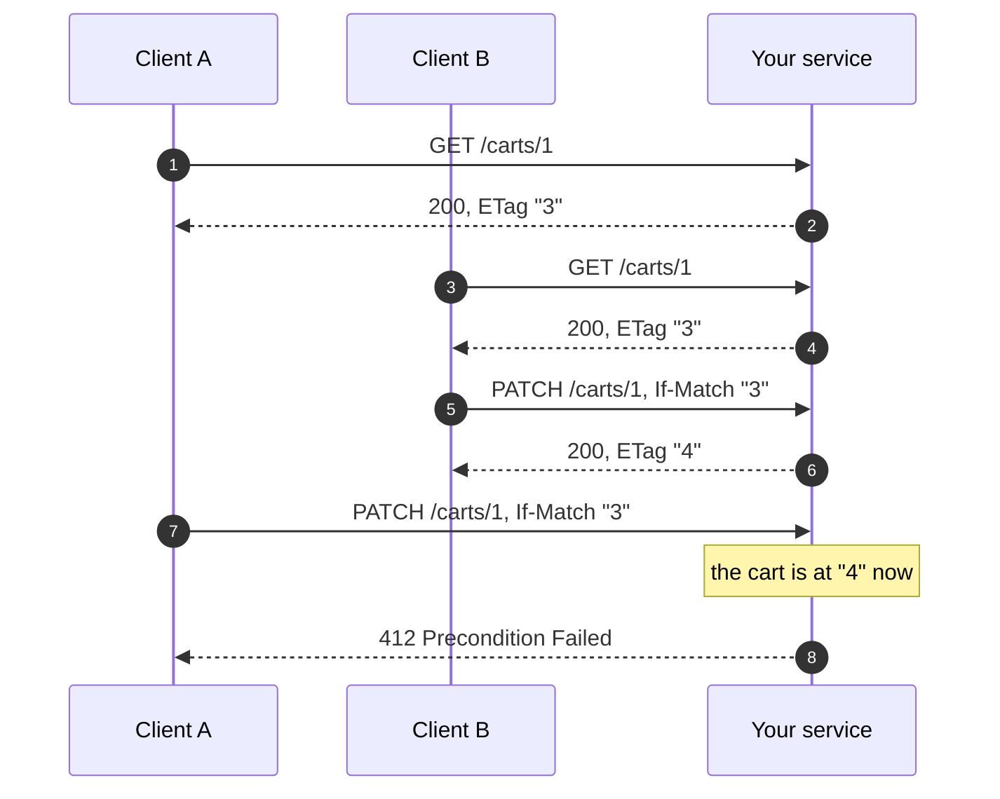

# Conditional Requests

Two clients read the same cart. Both edit it. Both send it back. The second
write silently erases the first.

That is the lost update problem. HTTP has had the answer since it had `ETag`:
the read hands out a tag, the write sends it back, and the service refuses the
write if the resource moved on.



Client A went for a coffee and came back to a resource that had moved. Its
write is refused instead of erasing B's change.

## Wiring

Register `ConditionalRequests()`, and `micro.install(app)` adds the middleware:

```python title="conditional.py"
--8<-- "http/conditional.py"
```

That one component is the whole opt-in. `micro.install(app)` then:

- answers `412` and `428` on the wire, rather than letting them become a `500`,
- puts `If-Match` and `If-None-Match` in the OpenAPI schema, so Swagger offers
  the fields and a generated client sends them,
- adds the `ETag` and the `304`.

[`ErrorResponses()`](errors.md) is about **format, not status**. Register it to
answer in RFC 9457 or TM Forum across the whole app. Leave it out and a
refusal is still a refusal, rendered as RFC 9457, which an error body always
needs.

It works on FastAPI, Starlette, and Litestar. A framework that serves no HTTP,
such as FastStream, ignores it.

## Two calls

| Where | Call | What it does |
|---|---|---|
| Read | `check_freshness(version)` | Puts the `ETag` on the response. Returns `True` when the client already holds it. |
| Write | `check_precondition(version)` | Refuses a stale `If-Match` with `412`, and a missing one with `428`. |

Both take the same thing: whatever identifies the version. A version column, or
the resource itself when there is no column. Neither needs a `Response` object
in the handler signature, so the same line works on every framework.

On FastAPI they can be injected instead, which is the same implementation with
the dependency the framework expects:

```python
from grelmicro.integrations.fastapi import Conditional


@app.patch("/carts/{cart_id}")
async def update(cart_id: int, conditional: Conditional) -> Cart:
    cart = await load(cart_id)
    conditional.check(cart.version)  # 412 / 428
```

`conditional.fresh(version)` is the read half. Use whichever reads better: the
imported functions are the portable form and work on Starlette and Litestar
too, the injected one is FastAPI-native.

The injected form declares `If-Match` and `If-None-Match` itself, so those show
up in the schema for that operation alone, and `conditional.check(...)` answers
from what the request carried whether or not `ConditionalRequests()` is
registered. `fresh` still needs the component, since only the middleware can
put the tag on the response.

## The read is what makes the write possible

A client can only send `If-Match` if a read gave it a tag. That makes the `GET`
the load-bearing half:

```python
@app.get("/carts/{cart_id}")
async def read(cart_id: int) -> Cart:
    cart = await load(cart_id)
    check_freshness(cart.version)
    return cart
```

```http
GET /carts/1 HTTP/1.1

HTTP/1.1 200 OK
etag: "3"

{"id":1,"items":["apple"],"version":3}
```

A client that sends that tag back in `If-None-Match` gets `304 Not Modified`
with no body.

**To skip the work as well as the bytes**, branch on the return value. It is
`True` when the client already holds this version:

```python
@app.get("/carts/{cart_id}")
async def read(cart_id: int) -> Cart:
    version = await repo.version(cart_id)  # one cheap column
    if check_freshness(version):
        raise HTTPException(status_code=304)
    return await repo.load(cart_id)  # the expensive part
```

Ignoring the return value is correct too. The client gets the same `304`, it
just costs the work of building a body nobody reads, and that holds for a
streamed response as well: the tag is known before the first byte, so the
stream is swapped for a `304` and what the handler goes on producing reaches
nobody. Either way the `304` carries the entity tag you recorded, which is what
[RFC 9110](https://www.rfc-editor.org/rfc/rfc9110.html) asks of one.

### What never gets a generated tag

Three responses, and none of them is held up waiting to be hashed:

| Response | Why |
|---|---|
| A streamed one | A body arriving in pieces goes out as it comes, so an event stream stays live. Tagging it would mean holding the whole thing. |
| One over `max_body_size` | A large download is never buffered. |
| A `204` | It carries no representation, and hashing its empty body would give every empty resource in the app the same tag. |

A handler that recorded a version with `check_freshness` still gets that tag on
the response in all three cases, since nothing had to be hashed to know it.

Register the component and call nothing, and responses still get an `ETag`,
hashed from the body. That covers a route you have not touched. A recorded
version is better: it tags what the resource is rather than what it serialized
to, and it spares the middleware buffering the body.

## The write checks it

```python
@app.patch("/carts/{cart_id}")
async def update(cart_id: int, body: CartIn) -> Cart:
    cart = await load(cart_id)
    check_precondition(cart.version)
    return await save(cart_id, body.items, expected=cart.version)
```

The client sends back what it read, and the write goes through while it is
current:

```http
PATCH /carts/1 HTTP/1.1
If-Match: "3"

HTTP/1.1 200 OK
etag: "4"
```

Someone got there first, so the second write is refused:

```http
PATCH /carts/1 HTTP/1.1
If-Match: "3"

HTTP/1.1 412 Precondition Failed
content-type: application/problem+json

{
  "type": "https://grelmicro.grel.info/http/errors/#precondition-failed",
  "title": "Precondition failed",
  "status": 412,
  "detail": "The resource changed since the entity tag in If-Match was issued. Read it again and retry with the new one.",
  "instance": "/carts/1"
}
```

A client that sends no precondition at all is told to, with the status
[RFC 6585](https://www.rfc-editor.org/rfc/rfc6585.html) added for this exact
case:

```http
PATCH /carts/1 HTTP/1.1

HTTP/1.1 428 Precondition Required
```

### What each refusal answers

| The client did | Status | Why that one |
|---|---|---|
| Sent an `If-Match` that is not the current tag | `412` | The precondition evaluated false. |
| Sent no precondition on a write that requires one | `428` | The write has to be conditional, and the client can fix that. |
| Sent `If-None-Match: *` for a resource that exists | `412` | The create it asked for cannot happen. |
| Sent a malformed or unquoted `If-Match` | `412` | It matches no entity tag, which is a precondition that failed. |

All four are `4xx`, because all four are something the client can fix, and all
four are written by grelmicro, so they read the same on FastAPI, Starlette and
Litestar, byte for byte.

### Creating without overwriting

`If-None-Match: *` asks for the write to happen only if nothing is there. Pass
`None` when the resource does not exist, and one guard covers the create:

```python
cart = await find(cart_id)
check_precondition(cart.version if cart else None)
```

The first call through creates. Every later one gets `412`, whoever raced it.

## Enforcing it

Two doors, for two different rules.

**Per route.** `check_precondition` requires a precondition unless you say
otherwise, so a guarded route already answers `428` to a `PATCH` without
`If-Match`. Allow an unconditional write with:

```python
check_precondition(cart.version, require=False)
```

**Across the app**, for a service where every write must be conditional. Name
the methods, and the middleware refuses them before routing:

```python
ConditionalRequests(require_precondition=("PUT", "PATCH", "DELETE"))
```

`POST` is left out of that set on purpose: a create has nothing to match
against yet. Reads are never affected. `exclude=("/webhooks/*",)` carves out
paths that must stay open. Either header counts, so `If-None-Match: *` still
creates under enforcement.

Setting both is fine. The middleware answers first, and the handler's own check
then never sees a request without a precondition.

## Which endpoints it applies to

The two halves are selected differently, on purpose.

**The write guard is per route by construction.** A route is guarded because it
calls `check_precondition`. A route that does not call it is not guarded, so
there is no list to keep in step with the code.

**The read half applies to every response**, since an `ETag` costs nothing and
a client cannot send back what it never received. Two path filters narrow it,
and they follow the router the endpoints are grouped on:

```python
ConditionalRequests(
    include=("/carts/*",),  # empty means every path
    exclude=("/carts/legacy",),  # wins over include
)
```

Exact match unless the pattern ends with `*`, which matches as a prefix, the
same as every grelmicro middleware. What the middleware skips stays out of the
OpenAPI schema too, so what is documented is what happens.

**`require_precondition` is the app-wide rule** on top of that, listing the
methods that must arrive conditional whatever the handler does.

## It runs behind your authentication

`micro.install(app)` puts grelmicro's middleware **innermost**, behind every
middleware the app added itself, whichever order the two were wired in.

That placement is not a preference. A middleware that answers a request on its
own, such as a `304` or a refused precondition, must never be the reason a request skipped
the authentication in front of your handlers. Innermost means a replay is
served only after your own middleware has run and let the request through, so a
caller who learns another caller's key is turned away exactly as they would be
on a first request.

`GrelmicroMiddleware` stays outermost, because it only binds a context variable
and changes nothing a client can see.

!!! warning "Litestar builds its stack at construction"
    There, `install` can only wrap the whole app, which puts the middleware
    outside the app's own. grelmicro warns with
    [`middleware-placement`](../diagnostics.md#middleware-placement) and names
    the fix: pass it to `Litestar(middleware=[...])`, after your authentication,
    and `install` then leaves it alone.

## Entity tags

An entity tag is the opaque string a client sends back to say which version it
holds. `check_freshness` and `check_precondition` build one for you, so most
handlers never call `etag_of` at all.

Reach for it directly in four places:

- Setting a tag on a response the middleware will not tag, such as a stream.
- Handing an already-built tag to `check_precondition(etag=...)`.
- Storing a tag beside a cached object, so a later read serves both together.
- Comparing tags yourself, in a client of another service.

### What it accepts

```python
etag_of(cart.version)  # a version column -> "7"
etag_of(cart)  # a pydantic model -> "b1946ac9..."
```

| You pass | You get | How |
|---|---|---|
| `int`, `str`, `UUID` | `"7"`, `"v7"`, `"0000...0001"` | Used as it stands, in quotes. |
| `datetime` | `"2026-08-20T10:00:00+00:00"` | ISO 8601, in quotes. |
| `bytes` | `"2cf24dba..."` | SHA-256 of the bytes. |
| A pydantic model | `"b1946ac9..."` | `model_dump(mode="json")`, then SHA-256 of the canonical JSON. |
| A dict, list or tuple | `"b1946ac9..."` | SHA-256 of the canonical JSON. |
| `weak=True` | `W/"7"` | The same tag, marked weak. |

A version token is used rather than hashed, because it already identifies the
version and hashing would only make it longer.

### Which source to use

**Prefer a version token.** A hash of the representation changes whenever the
serialization changes, so adding one field to the model changes every tag the
service ever issued, and every client holding one gets `412` until it reads
again. A version column moves only when the resource does.

| Source | Tag | Watch out for |
|---|---|---|
| A `version` integer column | `"7"` | Nothing. This is the one to reach for. |
| `updated_at` | `"2026-08-20T10:00:00+00:00"` | Two writes inside one clock tick share a tag. |
| A pydantic model or dict | SHA-256 of the canonical JSON | Every serialization change invalidates every client's tag. |
| Postgres `xmin` | `"84213"` | A `VACUUM FREEZE` rewrites it, so tags change with no write. |

The serialization is canonical: sorted keys, no spaces, and the standard
library rather than whichever JSON library is installed. Two replicas therefore
produce the same tag for the same value, which a mixed fleet during a rollout
depends on.

### Weak tags

`etag_of(value, weak=True)` marks a tag weak, which says "equivalent, not byte
for byte". A weak tag still answers `304` on a read, and never satisfies an
`If-Match`, because
[RFC 9110](https://developer.mozilla.org/en-US/docs/Web/HTTP/Reference/Headers/If-Match)
gives that header strong comparison. Use it for a representation that varies
without the resource changing, never for a write guard.

### What it refuses

It fails loudly rather than issuing a tag that cannot do its job:

| Value | Why |
|---|---|
| `etag_of(True)` | `TypeError`. A boolean version is a mistake, not the tag `"True"`. |
| `etag_of('has "quotes"')` | `ValueError`. An entity tag carries no quote or control character. |
| `etag_of("v1,rev2")` | `ValueError`. A comma separates two tags in one header, so no tag may hold one. |
| `etag_of(object())` | `TypeError`. A tag comes from data, never from a repr. |
| `etag_of('"3"')` | `ValueError`, naming the other door: this is already a tag, so pass `check_precondition(etag=...)`. |

## Playing with the database

`check_precondition` is a check, not a lock. Between it and your write, another
request can land. So the write itself has to be safe too.

Three ways, all behind the same `If-Match`. Whichever you pick, the client sees
the same `412`.

| Strategy | Holds a lock | Reach for it when |
|---|---|---|
| **Conditional `UPDATE` on a version column** | No | The default. The resource is a row and the client holds its version. |
| `SELECT ... FOR UPDATE` | A row lock, for the transaction | The write reads several rows and needs them to agree. |
| grelmicro [`ReadWriteLock`](../coordination/read-write-lock.md) | A distributed lock | The state is not a SQL row: object storage, an external API, a cache. |

### Conditional UPDATE, the preferred one

Put the version in the `WHERE` clause. The write either matches the version the
client held or changes nothing, in one statement, with no lock held anywhere:

```python
result = await session.execute(
    update(Cart)
    .where(Cart.id == cart_id, Cart.version == expected)
    .values(items=items, version=Cart.version + 1)
)
if result.rowcount == 0:
    raise PreconditionFailedError
```

`rowcount == 0` is the whole conflict detection. It holds nothing across client
think time and scales to as many replicas as you run.

SQLAlchemy's ORM writes that statement for you from a
[version_id_col](https://docs.sqlalchemy.org/en/20/orm/versioning.html)
mapping, and raises `StaleDataError` where the raw form returns zero rows:

```python
from sqlalchemy.orm.exc import StaleDataError


class Cart(Base):
    __mapper_args__ = {"version_id_col": version}


try:
    await session.commit()
except StaleDataError:
    raise PreconditionFailedError from None
```

`check_precondition` still earns its place in front of it. It refuses the stale
write before the handler does any work, and it is what turns a missing
`If-Match` into `428`.

### SELECT ... FOR UPDATE

When the write is a read-modify-write over more than one row, take the row lock
inside the transaction and compare there:

```python
async with session.begin():
    cart = await session.get(Cart, cart_id, with_for_update=True)
    check_precondition(cart.version)
    cart.items = items
    cart.version += 1
```

`session.begin()` commits when the block ends and rolls back if anything in it
raises, so a refused precondition releases the lock and writes nothing. There
is no commit to write yourself.

The lock lives and dies inside that transaction. **Never hold one across the
client's think time**: a lock taken when the client reads and released when it
writes back is a lock held for as long as someone leaves a tab open.

### grelmicro ReadWriteLock

When the state is not a row, there is no `WHERE` clause to make conditional.
Take a distributed [`ReadWriteLock`](../coordination/read-write-lock.md) around
the read-modify-write, and keep the check inside it:

```python
async with ReadWriteLock(f"cart:{cart_id}").write:
    cart = await store.load(cart_id)
    check_precondition(cart.version)
    await store.save(cart.apply(items))
```

Name the lock per resource, never one lock for the whole collection, or every
cart in the system queues behind every other.

!!! question "Do reads have to take the lock too?"
    **No, and they should not.** The lock exists to make one writer's
    read-modify-write indivisible. A reader that skips it may hand out a tag
    that is one write stale, and that costs nothing: the client's next write
    sends that tag, the write path sees it is stale, and the client gets `412`
    and reads again. Correctness lives in the write.

    Taking a read lock on every `GET` puts a round trip to the lock backend on
    your hottest path and buys only a fresher tag.

    The exception is a store where one logical resource spans several objects
    or keys, and a reader can catch a writer halfway through. Then readers take
    the read side so they never see half a write. That is a read-consistency
    problem, not an optimistic-locking one.

    Keep the write section short whatever you do. The lock holds a lease, and a
    writer that pauses past it can be overtaken. `WriteGuard` carries
    `fencing_token` and `poisoned` for exactly that.

### Raise it on the request task

`check_precondition` reads the request through a context variable, and a child
task starts from a copy of its parent's context, so a check inside a task group
or a transaction helper still sees the request it belongs to.

The exception is what does not travel. A task group raises an `ExceptionGroup`,
and a framework matches its handlers by type, so a rejection left inside one
reaches the client as `500`. Unwrap it before it leaves the handler:

```python
try:
    async with anyio.create_task_group() as tasks:
        tasks.start_soon(work)
except* PreconditionFailedError as group:
    raise group.exceptions[0] from None
```

### How these are held

`tests/test_conditional_database.py` runs each strategy against a database and
loses the race on purpose: two writers read the same version, one wins, and the
other has to reach the client as `412`. The conditional `UPDATE` and the ORM
mapping run on SQLite, and `SELECT ... FOR UPDATE` runs on a real Postgres,
because a row lock is the thing under test and SQLite has none.

## Alongside idempotency

`If-Match` and `Idempotency-Key` answer different questions, and compose:

- `Idempotency-Key` makes **the same write** safe to send twice.
- `If-Match` stops **a different write** erasing one it never saw.

A retried write carrying both replays the stored response, `412` included,
because [errors replay too](idempotency.md#errors-replay-too).
The retry of a refused write is still refused.

## In Swagger

`install` annotates the generated schema, so the headers are reachable from the
UI rather than something a reader has to know about:

| Operation | Gains |
|---|---|
| `GET`, `HEAD` | An `If-None-Match` field, and the `304` it can answer. |
| `PUT`, `PATCH`, `DELETE` | An `If-Match` field, plus the `412` and `428` responses. |
| `POST` | Nothing. A create has no version to match against. |

The `If-Match` field is marked required exactly when the service refuses
without it, which is when the method is named in `require_precondition`.
`exclude` keeps a path out of the schema as well as out of the middleware, and
`openapi=False` turns the annotation off for a service that publishes its own.

The refusal responses point at the model the app answers with, so a client
generated from the schema decodes `TMFError` when `ErrorResponses.tmf()` is
registered, and `ProblemDetail` otherwise.

## Component parameters

`ConditionalRequests` and `ConditionalRequestsMiddleware` take the same
options, so a registered component and a hand-added middleware answer the same.

| Parameter | Default | Behaviour |
|---|---|---|
| `etag_responses` | `True` | Hash the body of a `2xx` response that carries no `ETag` and no recorded version. |
| `require_precondition` | `()` | Methods answered `428` at the edge when they carry no precondition. Empty leaves the decision to the handler. |
| `include` | `()` | Paths the middleware acts on. Empty means every path. Exact match unless the pattern ends with `*`. |
| `exclude` | `()` | Paths the middleware leaves alone, whatever `include` says. |
| `max_body_size` | `1048576` | Largest response body held in memory to hash, in bytes. |
| `openapi` | `True` | Describe the headers and their responses in the OpenAPI schema. Component only, and only FastAPI builds one. |
| `name` | `"default"` | Registration name. Component only. |
