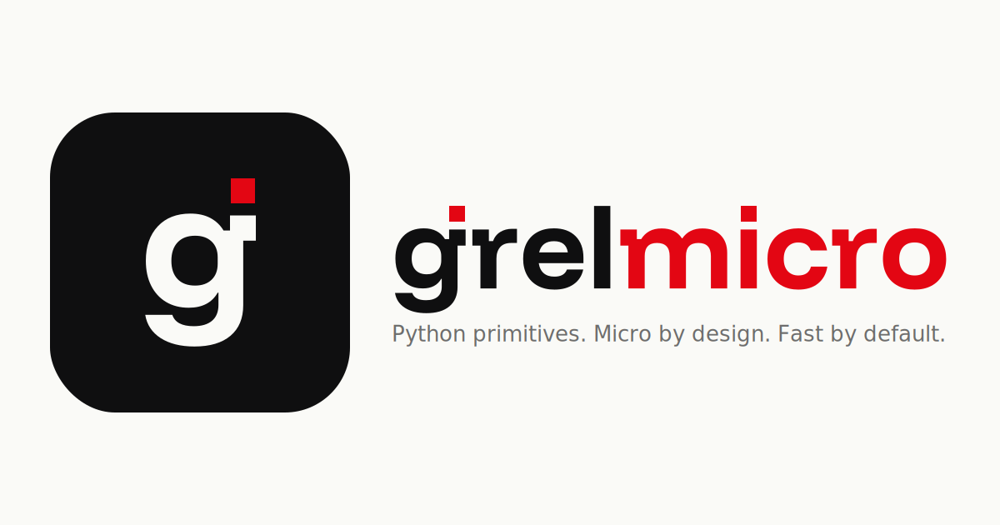

# grelmicro brand assets

Every SVG contains outlined glyph paths, so there is no web-font or
font-file dependency at runtime. Every position is measured from the
font's actual glyph data (ascender top, dot contour, g-stem midpoint),
not tuned by eye.

Regenerate with:

```bash
uv run docs/img/logo/build_logo.py
```

## Wordmark variants

Four variants ship. Pick the one that matches the surface your
consumer controls.

| File | Background | Letters | Use when |
|---|---|---|---|
| `wordmark.svg` | paper `#FAFAF7` plate | ink | **Default.** Universal fallback: GitHub README, PyPI long-description, any renderer that can't style images. Readable on any surface. |
| `wordmark-dark.svg` | ink `#0F0F10` plate | paper | Explicit dark-mode asset. Hand-picked when you *know* the host is dark and want the plate to match. |
| `wordmark-transparent.svg` | transparent | ink | The host page controls the surface. Use on a known paper / light background, or let CSS pick per theme. |
| `wordmark-transparent-dark.svg` | transparent | paper | Same, for a known ink / dark background. |

The red square on the `i` is always `#E30613`, aligned to the
ascender top, sized to the font's natural dot. Do not move or
recolour it.

On the docs site we swap `wordmark.svg` for the transparent variants
via `[data-md-color-scheme]` in `docs/css/overrides.css`, so the
plate disappears and the mark flows with the page. GitHub and PyPI
ignore that CSS and keep the plated default.

## Favicon

Rounded square plate, used as favicon, GitHub avatar, and social avatar.

| Light | Dark |
|---|---|
|  |  |

PNG sizes shipped for non-SVG contexts:

`favicon-16.png` · `favicon-32.png` · `favicon-48.png` ·
`favicon-192.png` · `favicon-512.png` · `apple-touch-icon.png` (180×180)

## Social preview

Open Graph / Twitter / Slack / Discord card (1200×630). Shown when the
URL is shared on social platforms.



## HTML wiring

```html
<link rel="icon" type="image/svg+xml" href="img/logo/favicon.svg">
<link rel="icon" type="image/png" sizes="32x32" href="img/logo/favicon-32.png">
<link rel="icon" type="image/png" sizes="16x16" href="img/logo/favicon-16.png">
<link rel="apple-touch-icon" sizes="180x180" href="img/logo/apple-touch-icon.png">
<meta property="og:image"
      content="https://grelinfo.github.io/grelmicro/img/logo/social-preview.png">
```

## Brand

| Property | Value |
|---|---|
| Hero red | `#E30613` |
| Ink | `#0F0F10` |
| Paper | `#FAFAF7` |

## License

Source code MIT. Glyph outlines embedded under SIL OFL 1.1 (see the
repo-root [`THIRD_PARTY_NOTICES.md`](../../../THIRD_PARTY_NOTICES.md)).
