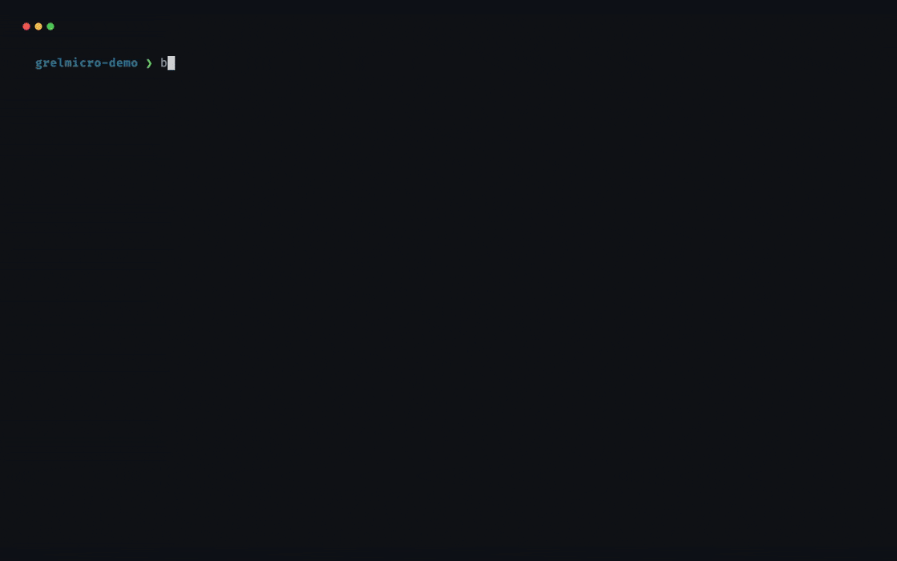

<p align="center">
  <a href="https://grelmicro.grel.info">
    
  </a>
</p>

<p align="center">
  <em>Async-first toolkit. Microservice patterns inside.</em>
</p>

<p align="center">
  A Python toolkit for distributed systems: microservices, modular monoliths, and self-contained systems.
</p>

<p align="center">
  <a href="https://pypi.org/project/grelmicro/"></a>
  <a href="https://pypi.org/project/grelmicro/"></a>
  <a href="https://github.com/grelinfo/grelmicro/blob/main/LICENSE"></a>
  <a href="https://codecov.io/gh/grelinfo/grelmicro"></a>
  <a href="https://github.com/astral-sh/uv"></a>
  <a href="https://github.com/astral-sh/ruff"></a>
  <a href="https://github.com/astral-sh/ty"></a>
  <a href="https://securityscorecards.dev/viewer/?uri=github.com/grelinfo/grelmicro"></a>
  <a href="https://www.bestpractices.dev/projects/13655"></a>
  <a href="https://slsa.dev/spec/latest/levels"></a>
</p>

<p align="center">
  
</p>

______________________________________________________________________

**Documentation**: [https://grelmicro.grel.info/](https://grelmicro.grel.info)

**Source Code**: [https://github.com/grelinfo/grelmicro](https://github.com/grelinfo/grelmicro)

______________________________________________________________________

## What your service gains

Your FastAPI, Starlette, Litestar or FastStream service keeps its routes, its lifespan and its database code. grelmicro adds what a service needs once it runs on more than one replica:

- a scheduled job that runs once per interval across replicas, not on each of them,
- a lock, a cache and a rate limit that every replica shares,
- a retry, a circuit breaker and a timeout around the calls that fail,
- health probes, logs, traces and metrics that Kubernetes and your dashboards read.

Use one pattern, a few, or all of them. Each one you add works with the ones you have. Pay only for what you import: grelmicro needs three dependencies, each backend is an extra, and a module loads only what it uses.

One line says where the shared state lives: Redis, Valkey, PostgreSQL or SQLite. Change that line and the rest of the code stays the same.

Every pattern behaves the same on each framework, and a [parity test](https://grelmicro.grel.info/frameworks/#how-the-claim-is-held) holds the claim. The hot paths run in a compiled Rust core: a JWT signature check is about four times faster than in a pure-Python library.

Coming from another stack? See the mapping for [Spring Boot](https://grelmicro.grel.info/coming-from/spring-boot/), [Quarkus](https://grelmicro.grel.info/coming-from/quarkus/), [Django](https://grelmicro.grel.info/coming-from/django/), [Laravel](https://grelmicro.grel.info/coming-from/laravel/) or [Symfony](https://grelmicro.grel.info/coming-from/symfony/).

## Start with one pattern

Run a job once a minute across all your replicas, not once per replica. Create a file `main.py` with:

```python
from fastapi import FastAPI

from grelmicro import Grelmicro
from grelmicro.providers.redis import RedisProvider
from grelmicro.task import Tasks

app = FastAPI()
tasks = Tasks()
micro = Grelmicro(uses=[RedisProvider("redis://localhost:6379/0"), tasks])
micro.install(app)


@tasks.every(seconds=60, gate="claim")
async def send_report() -> None:
    print("report sent by this copy")
```

Start Redis, then run each copy of the app in its own terminal:

```bash
docker run -d -p 6379:6379 redis
pip install "grelmicro[fastapi,redis]" "fastapi[standard]"

# Terminal 1
fastapi run main.py

# Terminal 2
fastapi run main.py --port 8001
```

Each minute the report is sent once, by whichever copy claims it. `micro.install(app)` opens grelmicro when the app starts and closes it when the app stops. Already pass a `lifespan` to `FastAPI(...)`? It keeps running.

## Add the next one

The same provider line serves every pattern you add. Here a lock keeps two inventory syncs from running at once across replicas, and a circuit breaker stops calling a warehouse service that keeps failing. The job from above stays:

```python
from fastapi import FastAPI

from grelmicro import Grelmicro
from grelmicro.coordination import Lock
from grelmicro.providers.redis import RedisProvider
from grelmicro.resilience import CircuitBreaker
from grelmicro.task import Tasks

app = FastAPI()
tasks = Tasks()
micro = Grelmicro(uses=[RedisProvider("redis://localhost:6379/0"), tasks])
micro.install(app)

sync_lock = Lock("inventory-sync")
warehouse = CircuitBreaker("warehouse")


@app.post("/inventory/sync")
async def sync_inventory() -> dict[str, str]:
    async with sync_lock, warehouse:
        return {"status": "synced"}  # your warehouse call


@tasks.every(seconds=60, gate="claim")
async def send_report() -> None:
    print("report sent by this copy")
```

Both copies now share the lock and the breaker's state as well as the job.

## What each module guarantees

| Module | Guarantee |
|---|---|
| [**Cache**](https://grelmicro.grel.info/cache/) | `@cached(ttl=30)` memoizes in one process. `@cached(TTLCache(...))` shares entries across replicas, and concurrent misses on one key run the function once per process. With a `Coordination` backend, `lock=True` runs it once across replicas. |
| [**Idempotency**](https://grelmicro.grel.info/idempotency/) | A repeated key within `ttl` replays the stored response without running the operation again. |
| [**Coordination**](https://grelmicro.grel.info/coordination/) | A `Lock` has one holder at a time for as long as its lease, and a `LeaderElection` one leader. A `lost` renewal metric tells you when the work outran the lease. |
| [**Outbox**](https://grelmicro.grel.info/outbox/) | A message published inside your transaction runs its handler at least once, and never for a transaction that rolled back. |
| [**Task Scheduler**](https://grelmicro.grel.info/task/) | With `gate="claim"`, one worker runs each interval or cron fire. A claimed cron fire runs at most once, and a fire missed while every worker was down replays once. |
| [**Resilience**](https://grelmicro.grel.info/resilience/) | An open [circuit breaker](https://grelmicro.grel.info/resilience/circuit-breaker/) fails calls fast until `reset_timeout`, then lets a few probe calls through. A [Rate Limiter](https://grelmicro.grel.info/resilience/rate-limiter/) on a shared backend counts one budget for every replica. [Retry](https://grelmicro.grel.info/resilience/retry/), [Timeout](https://grelmicro.grel.info/resilience/timeout/), [Bulkhead](https://grelmicro.grel.info/resilience/bulkhead/) and [Fallback](https://grelmicro.grel.info/resilience/fallback/) compose through a [Shield](https://grelmicro.grel.info/resilience/shield/). |
| [**Health**](https://grelmicro.grel.info/health/) | Each check runs at most once per `cache_ttl`, however many probes arrive. |
| [**Security**](https://grelmicro.grel.info/security/) | A [JWT](https://grelmicro.grel.info/security/jwt/)  is accepted only with a valid signature and `exp`, and with `aud` and `iss` when you name them. Signing keys refresh from the JWKS when they rotate. [Client IP](https://grelmicro.grel.info/security/clientip/) trusts only your own proxies. |
| [**Logging**](https://grelmicro.grel.info/logging/), [**Tracing**](https://grelmicro.grel.info/tracing/), [**Metrics**](https://grelmicro.grel.info/metrics/) | A log line written inside a traced request carries that request's trace and span id. |
| [**Configuration**](https://grelmicro.grel.info/config/) | `ExternalConfig` changes a running component's settings from a mounted ConfigMap, Secret or file, without a restart. |

grelmicro is **not** a task queue (reach for Celery, Dramatiq, or taskiq), **not** a message broker client (reach for FastStream to publish and subscribe over Kafka, RabbitMQ, NATS, or Redis), and **not** a web framework (it plugs into FastAPI, Starlette, Litestar, and FastStream). It fills the gap between the web framework you picked and the infrastructure you run.

Already using `aiocache`, `slowapi`, `pybreaker`, `tenacity`, or `aioredlock`? See the [comparison page](https://grelmicro.grel.info/comparison/) for a per-domain breakdown.

Pre-1.0, the API may change on a minor release. `1.x` follows standard semver.

## Installation

```bash
pip install grelmicro
```

See the [Installation guide](https://grelmicro.grel.info/installation/) for `uv` and `poetry` commands, plus optional extras for Redis, PostgreSQL, SQLite, Kubernetes, OpenTelemetry, structlog, and JWT verification.

## Run the demo

Want to see every pattern running against real Redis and Postgres? The [FastAPI demo](https://github.com/grelinfo/grelmicro/tree/main/examples/fastapi-demo) starts in three commands:

```bash
cd examples/fastapi-demo
docker compose up --wait
open http://localhost:8000/docs
```

It wires a cached endpoint, a rate-limited endpoint, a circuit-breaker-protected endpoint, a distributed lock, a leader-gated task, and `/healthz` / `/readyz` probes. Read [`app.py`](https://github.com/grelinfo/grelmicro/blob/main/examples/fastapi-demo/app.py) to see each one.

The [User Guide](https://grelmicro.grel.info/first-steps/) covers multiple Redis instances, separate names and test overrides.

## Contributing

Report bugs and request features in [GitHub issues](https://github.com/grelinfo/grelmicro/issues/new/choose). The [reporting guide](https://github.com/grelinfo/grelmicro/blob/main/CONTRIBUTING.md#reporting-a-bug) lists what to include and what happens after you file.

To contribute code or docs, read the [contributing guide](https://github.com/grelinfo/grelmicro/blob/main/CONTRIBUTING.md). It explains the pull request process and the requirements for acceptable contributions: the development setup, the code style, and the pre-merge checklist.

Report security issues privately through the [security policy](https://github.com/grelinfo/grelmicro/security/policy), not a public issue.

## License

This project is licensed under the terms of the [MIT license](https://github.com/grelinfo/grelmicro/blob/main/LICENSE).
