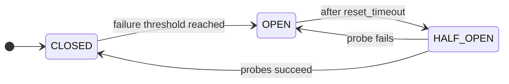

# Circuit Breaker

A **Circuit Breaker** prevents repeated failures when calling an unreliable downstream. After too many consecutive failures it **opens** to block further calls for a cool-down period, so the dependency can recover.

**Why**

- Prevent cascading failures across services.
- Stop a failing dependency from exhausting every thread or connection in your pool.
- Expose the health of a dependency at the breaker boundary, so each caller does not have to track it.

## Usage

Wrap the protected call with `async with cb:` or decorate an async function with `@cb`:

```python
--8<-- "resilience/circuitbreaker.py"
```

!!! warning "Thread safety"
    The Circuit Breaker is not thread-safe. The async API (`async with cb:` or `@cb` on `async def`) is the default. From a synchronous handler running in a worker thread (for example a sync route in your web framework), use `with cb.from_thread:` or apply `@cb` to a sync function. The adapter dispatches state changes onto the parent event loop captured by the backend, so calls stay serialized. See [Sync from thread](../architecture/sync-from-thread.md).

## State machine

The breaker watches call outcomes and moves between three normal states. After `reset_timeout`, it lets a few probe calls test whether the dependency is back.



??? note "All five states"

    Three normal states (`CLOSED`, `OPEN`, `HALF_OPEN`) plus two manual overrides (`FORCED_OPEN`, `FORCED_CLOSED`).

    | State         | Description                                                        |
    |---------------|--------------------------------------------------------------------|
    | **CLOSED**        | Normal operation. Calls are allowed.                               |
    | **OPEN**          | Calls are blocked to let the dependency recover.                   |
    | **HALF_OPEN**     | A limited number of probe calls test whether the dependency is back. |
    | **FORCED_OPEN**   | Manual override that blocks every call.                            |
    | **FORCED_CLOSED** | Manual override that allows every call.                            |

## Backend

By default each replica keeps its own breaker state. A degraded downstream trips one replica's breaker without telling the others, and `error_threshold` errors must happen on every replica before the dependency stops being probed.

Pass a shared `CircuitBreakerRegistry(redis_provider)` or `CircuitBreakerRegistry(postgres_provider)` to fan that state out. The first replica to trip the breaker opens it for the fleet, the `half_open_capacity` admission cap is enforced globally so probes never exceed the cap across replicas, and manual `transition_to_*` calls are visible everywhere.

!!! tip "Install"
    The Redis backend needs the `redis` extra and the Postgres backend needs the `postgres` extra: `pip install "grelmicro[redis]"` or `pip install "grelmicro[postgres]"`. See the [installation guide](../installation.md) for `uv` and `poetry`.

=== "Redis (shared)"
    ```python
    --8<-- "resilience/circuitbreaker_redis.py"
    ```

=== "Postgres (shared)"
    ```python
    --8<-- "resilience/circuitbreaker_postgres.py"
    ```

=== "SQLite (single-host)"
    ```python
    --8<-- "resilience/circuitbreaker_sqlite.py"
    ```

=== "Memory (per-replica)"
    No setup required. When no `CircuitBreakerRegistry` is registered on the `Grelmicro` app, the breaker uses an in-process adapter and state is local to the replica.

!!! warning
    Use environment variables for connection URLs in production, not hard-coded strings like the example above.

### Choosing a backend

Use a **shared** backend (Redis or Postgres) when one replica's circuit decision should short-circuit the rest. Pick Redis for the lowest-latency option when you already run it, or Postgres when it is your only stateful dependency. Use **SQLite** when many processes on a single host share one file and you want their circuit decisions to coordinate without an external service. SQLite is a local file, so it coordinates processes on one host, not across hosts. Use **Memory** (the default) when each replica's downstream is independent (per-shard databases, per-zone caches).

When the shared backend is unreachable, calls to the breaker raise the underlying client error. Wrap the protected block with [`Retry`](retry.md) or a Fallback Pattern if you need a degraded path during an outage.

??? note "Local vs. shared, and how shared state is stored"

    | | **Memory (local)** | **Redis / Postgres (shared)** |
    |---|---|---|
    | State scope | Per replica | Fleet-wide |
    | Half-open admission cap | Enforced per replica | Enforced globally |
    | Manual `transition_to_*` | Visible to one replica | Visible to every replica |
    | `last_error` / `last_error_time` | Per replica | Per replica |
    | `total_error_count` / `total_success_count` | Per replica | Per replica |

    The Postgres adapter stores breaker state in a single `grelmicro_circuit_breaker` table. Every admission and counter update runs inside a PL/pgSQL function that holds `pg_advisory_xact_lock` for the breaker name, so concurrent replicas converge to the same state. The Redis adapter does the same with atomic Lua scripts. The SQLite adapter stores the same row and runs each read-modify-write inside a write transaction, so processes sharing the file on a single host converge on the same state.

## Configuration

Build the breaker with the factory classmethod.

```python
--8<-- "resilience/circuitbreaker_programmatic.py"
```

!!! tip "Advanced"
    For the `from_config` declarative path and `pydantic-settings` composition, see [Declarative configuration](../advanced/config.md).

## Reference

See the [API reference](../reference/resilience.md#grelmicro.resilience.CircuitBreaker) for every option.
