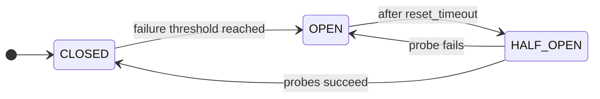

# Circuit CircuitBreakers

A **Circuit CircuitBreakers** prevents repeated failures when calling an unreliable downstream. It watches call outcomes and, after too many consecutive failures, **opens** to block further calls for a cool-down period so the dependency can recover.

**Why**

- Prevent cascading failures across services.
- Stop a failing dependency from exhausting every thread or connection in your pool.
- Expose the health of a dependency at the breaker boundary, so each caller does not have to track it.

## State machine

Three normal states (`CLOSED`, `OPEN`, `HALF_OPEN`) plus two manual overrides (`FORCED_OPEN`, `FORCED_CLOSED`).



| State         | Description                                                        |
|---------------|--------------------------------------------------------------------|
| **CLOSED**        | Normal operation. Calls are allowed.                               |
| **OPEN**          | Calls are blocked to let the dependency recover.                   |
| **HALF_OPEN**     | A limited number of probe calls test whether the dependency is back. |
| **FORCED_OPEN**   | Manual override that blocks every call.                            |
| **FORCED_CLOSED** | Manual override that allows every call.                            |

## Usage

```python
--8<-- "resilience/circuitbreaker.py"
```

!!! warning "Thread safety"
    The Circuit CircuitBreakers is not thread-safe. The async API (`async with cb:` or `@cb` on `async def`) is the default. From a synchronous handler running in a worker thread (for example a sync route in your web framework), use `with cb.from_thread:` or apply `@cb` to a sync function. The adapter dispatches state changes onto the parent event loop captured by the backend, so calls stay serialized. See [Sync from thread](../architecture/sync-from-thread.md).

See the [API reference](../reference/resilience.md#grelmicro.resilience.CircuitBreaker) for every option.

## Configuration

`CircuitBreaker` exposes two construction paths.

### Factory classmethod

```python
--8<-- "resilience/circuitbreaker_programmatic.py"
```

### Declarative

```python
--8<-- "resilience/circuitbreaker_declarative.py"
```

For environment-driven configuration, build a `ConsecutiveCountConfig` with `pydantic-settings` and pass it positionally to `CircuitBreaker.from_config(name, config)`.

## Backend

By default each replica keeps its own breaker state. A degraded downstream trips one replica's breaker without telling the others, and `error_threshold` errors must happen on every replica before the dependency stops being probed.

Pass a shared `CircuitBreakers(redis_provider)` to fan that state out. The first replica to trip the breaker opens it for the fleet, the `half_open_capacity` admission cap is enforced globally so probes never exceed the cap across replicas, and manual `transition_to_*` calls are visible everywhere.

!!! tip "Install"
    The Redis backend needs the `redis` extra: `pip install "grelmicro[redis]"`. See the [installation guide](../installation.md) for `uv` and `poetry`.

=== "Redis (shared)"
    ```python
    --8<-- "resilience/circuitbreaker_redis.py"
    ```

=== "Memory (per-replica)"
    No setup required. When no `CircuitBreakers` is registered on the `Grelmicro` app, the breaker uses an in-process adapter and state is local to the replica.

!!! warning
    Use environment variables for connection URLs in production, not hard-coded strings like the example above.

### Local vs. shared

| | **Memory (local)** | **Redis (shared)** |
|---|---|---|
| State scope | Per replica | Fleet-wide |
| Half-open admission cap | Enforced per replica | Enforced globally |
| Manual `transition_to_*` | Visible to one replica | Visible to every replica |
| `last_error` / `last_error_time` | Per replica | Per replica |
| `total_error_count` / `total_success_count` | Per replica | Per replica |

Use the shared backend when one replica's circuit decision should short-circuit the rest. Use local-only when each replica's downstream is independent (per-shard databases, per-zone caches).

When Redis is unreachable, calls to the breaker raise the underlying client error. Wrap the protected block with [`Retry`](retry.md) or a Fallback Pattern if you need a degraded path during a Redis outage.
