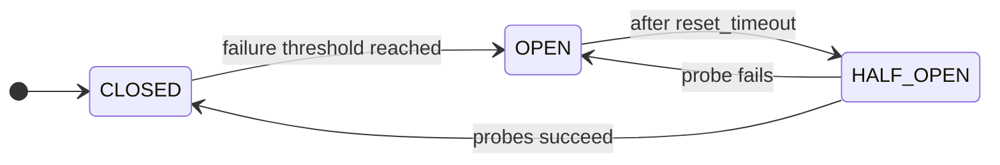

# Circuit Breaker

A **Circuit Breaker** prevents repeated failures when calling an unreliable downstream. It watches call outcomes and, after too many consecutive failures, **opens** to block further calls for a cool-down period so the dependency can recover.

**Why**

- Prevent cascading failures across services.
- Stop a failing dependency from exhausting every thread or connection in your pool.
- Expose the health of a dependency at the breaker boundary, so each caller does not have to track it.

## State machine

Three normal states (`CLOSED`, `OPEN`, `HALF_OPEN`) plus two manual overrides (`FORCED_OPEN`, `FORCED_CLOSED`).



| State         | Description                                                        |
|---------------|--------------------------------------------------------------------|
| **CLOSED**        | Normal operation. Calls are allowed.                               |
| **OPEN**          | Calls are blocked to let the dependency recover.                   |
| **HALF_OPEN**     | A limited number of probe calls test whether the dependency is back. |
| **FORCED_OPEN**   | Manual override that blocks every call.                            |
| **FORCED_CLOSED** | Manual override that allows every call.                            |

## Usage

```python
--8<-- "resilience/circuitbreaker.py"
```

!!! warning "Thread safety"
    The Circuit Breaker is not thread-safe. Decorated sync functions or `from_thread` methods ensure state changes run safely within the async event loop. Threaded usage is supported only in AnyIO worker threads and may be slower than pure async usage.

See the [API reference](../reference/resilience.md#grelmicro.resilience.CircuitBreaker) for every option.
