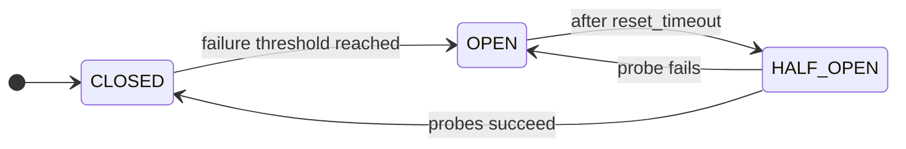

# Circuit Breaker

A **Circuit Breaker** prevents repeated failures when calling an unreliable downstream. It watches call outcomes and, after too many consecutive failures, **opens** to block further calls for a cool-down period so the dependency can recover.

**Why**

- Prevent cascading failures across services.
- Stop a failing dependency from exhausting every thread or connection in your pool.
- Expose the health of a dependency at the breaker boundary, so each caller does not have to track it.

## State machine

Three normal states (`CLOSED`, `OPEN`, `HALF_OPEN`) plus two manual overrides (`FORCED_OPEN`, `FORCED_CLOSED`).



| State         | Description                                                        |
|---------------|--------------------------------------------------------------------|
| **CLOSED**        | Normal operation. Calls are allowed.                               |
| **OPEN**          | Calls are blocked to let the dependency recover.                   |
| **HALF_OPEN**     | A limited number of probe calls test whether the dependency is back. |
| **FORCED_OPEN**   | Manual override that blocks every call.                            |
| **FORCED_CLOSED** | Manual override that allows every call.                            |

## Usage

```python
--8<-- "resilience/circuitbreaker.py"
```

!!! warning "Thread safety"
    The Circuit Breaker is not thread-safe. The async API (`async with cb:` or `@cb` on `async def`) is the default. From a synchronous handler running in a worker thread (for example a sync route in your web framework), use `with cb.from_thread:` or apply `@cb` to a sync function. The adapter dispatches state changes onto the parent event loop captured by the backend, so calls stay serialized. See [Sync from thread](../architecture/sync-from-thread.md).

See the [API reference](../reference/resilience.md#grelmicro.resilience.CircuitBreaker) for every option.

## Configuration

`CircuitBreaker` follows the three-paths configuration contract.

### Programmatic

```python
--8<-- "resilience/circuitbreaker_programmatic.py"
```

### Declarative

```python
--8<-- "resilience/circuitbreaker_declarative.py"
```

### Environmental

Prefix: `GREL_CIRCUIT_BREAKER_{NAME_UPPER}_`

| Env var                                                  | Config field         | Type                | Default      |
|----------------------------------------------------------|----------------------|---------------------|--------------|
| `GREL_CIRCUIT_BREAKER_{NAME_UPPER}_ERROR_THRESHOLD`      | `error_threshold`    | `int` (> 0)         | `5`          |
| `GREL_CIRCUIT_BREAKER_{NAME_UPPER}_SUCCESS_THRESHOLD`    | `success_threshold`  | `int` (> 0)         | `2`          |
| `GREL_CIRCUIT_BREAKER_{NAME_UPPER}_RESET_TIMEOUT`        | `reset_timeout`      | `float` (> 0)       | `30.0`       |
| `GREL_CIRCUIT_BREAKER_{NAME_UPPER}_HALF_OPEN_CAPACITY`   | `half_open_capacity` | `int` (> 0)         | `1`          |
| `GREL_CIRCUIT_BREAKER_{NAME_UPPER}_LOG_LEVEL`            | `log_level`          | `str`               | `"WARNING"`  |
| `GREL_CIRCUIT_BREAKER_{NAME_UPPER}_IGNORE_EXCEPTIONS`    | `ignore_exceptions`  | CSV or JSON list of FQN strings (e.g. `builtins.ValueError,my_app.errors.PaymentError` or `'["builtins.ValueError"]'`) | `[]`         |

Concrete example for `CircuitBreaker("payments")`:

```bash
GREL_CIRCUIT_BREAKER_PAYMENTS_ERROR_THRESHOLD=10
GREL_CIRCUIT_BREAKER_PAYMENTS_RESET_TIMEOUT=60
```

```python
--8<-- "resilience/circuitbreaker_environmental.py"
```
