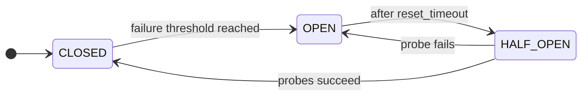

# Circuit Breaker

A **Circuit Breaker** prevents repeated failures when calling an unreliable downstream. After too many consecutive failures it **opens** to block further calls for a cool-down period, so the dependency can recover.

**Why**

- Prevent cascading failures across services.
- Stop a failing dependency from exhausting every thread or connection in your pool.
- Expose the health of a dependency at the breaker boundary, so each caller does not have to track it.

## Usage

Wrap the protected call with `async with cb:` or decorate an async function with `@cb`:

```python
--8<-- "resilience/circuitbreaker.py"
```

!!! warning "Thread safety"
    The Circuit Breaker is not thread-safe. The async API (`async with cb:` or `@cb` on `async def`) is the default. From a synchronous handler running in a worker thread (for example a sync route in your web framework), use `with cb.from_thread:` or apply `@cb` to a sync function. The adapter dispatches state changes onto the parent event loop captured by the backend, so calls stay serialized. See [Sync from thread](../architecture/sync-from-thread.md).

## Lifecycle

Declare a breaker once at module level and reuse it across requests:

```python
breaker = CircuitBreaker.consecutive_count("upstream")


async def handler() -> None:
    async with breaker:
        await call_upstream()
```

The circuit is owned by the backend and keyed by breaker name, so two instances sharing a name share one circuit. The state, the consecutive counters, and the `half_open_capacity` probe budget all live there. Building a breaker inside a per-request dependency still blocks calls correctly.

What a per-request instance loses is the per-instance reporting built on top of that circuit:

- `last_error` and `last_error_time`, on both `metrics()` and the raised `CircuitBreakerError`, are recorded locally and start empty on a fresh instance.
- `active_calls`, `total_error_count`, and `total_success_count` count only that instance, so they stay near zero.
- A fresh instance starts cached as `CLOSED`. Reading an already-open circuit then looks like a transition, which emits a `grelmicro.circuit_breaker.transitions` metric and a transition log line for a change that never happened.

Each construction also validates the config, creates a logger, and allocates a `ContextVar`. Build the breaker once.

## State machine

The breaker watches call outcomes and moves between three normal states. After `reset_timeout`, it lets a few probe calls test whether the dependency is back.


```mermaid
stateDiagram-v2
    direction LR
    [*] --> CLOSED
    CLOSED --> OPEN: failure threshold reached
    OPEN --> HALF_OPEN: after reset_timeout
    HALF_OPEN --> CLOSED: probes succeed
    HALF_OPEN --> OPEN: probe fails
```

??? note "All five states"

    Three normal states (`CLOSED`, `OPEN`, `HALF_OPEN`) plus two manual overrides (`FORCED_OPEN`, `FORCED_CLOSED`).

    | State         | Description                                                        |
    |---------------|--------------------------------------------------------------------|
    | **CLOSED**        | Normal operation. Calls are allowed.                               |
    | **OPEN**          | Calls are blocked to let the dependency recover.                   |
    | **HALF_OPEN**     | A limited number of probe calls test whether the dependency is back. |
    | **FORCED_OPEN**   | Manual override that blocks every call.                            |
    | **FORCED_CLOSED** | Manual override that allows every call.                            |

## Manual control

Two operator verbs let you drive the breaker by hand.

`await cb.isolate()` is the big red button. It forces the breaker open (`FORCED_OPEN`) and keeps it there, so every call is blocked until you reset. Use it to take a known-bad dependency out of rotation.

`await cb.reset()` returns the breaker to normal automatic operation. It clears the counters and the last error, then moves to `CLOSED`. Use it to release an `isolate()` hold or to start fresh.

## Per-key breaking

By default a breaker protects one circuit. Every call shares the same counters, so the whole dependency opens together. That is the right default when the dependency is either up or down for everyone.

Some failures are per-key instead. One tenant's credentials get revoked while every other tenant is fine. One model endpoint degrades while the rest answer normally. A single circuit either opens for everyone (a false positive) or never opens at all, because the healthy majority hides the broken key.

Call `cb.keyed(key)` to give each key its own circuit:

```python
--8<-- "resilience/circuitbreaker_keyed.py"
```

Each key gets independent counters, its own state, and its own cool-down. `keyed(key)` returns a full breaker, so `state`, `metrics()`, `isolate()`, `reset()`, `from_thread`, and the decorator form all work per key.

The unkeyed `async with cb:` path is unchanged and stays available on the same instance.

!!! warning "Key cardinality"
    A breaker keeps at most `maxsize` circuits resident (1024 by default) and evicts the least recently used. A circuit is never evicted while it has calls in flight or within 300 seconds of its last call. Set `maxsize=0` to keep every key, and only do that when the key set is bounded.

    Evicting an open circuit is safe. The backend owns the state, so the next call on that key rebinds and reads the same `OPEN` back. Only the per-replica counters and `last_error` reset.

    Metrics stay under the breaker name, not the key, so `grelmicro.circuit_breaker.calls` does not gain one time series per tenant. Read per-key detail with `cb.keyed(key).metrics()`. Log lines carry the full `name:key` identity.

## Backend

By default each replica keeps its own breaker state. A degraded downstream trips one replica's breaker without telling the others, and `error_threshold` errors must happen on every replica before the dependency stops being probed.

Pass a shared `CircuitBreakerRegistry(redis_provider)` or `CircuitBreakerRegistry(postgres_provider)` to fan that state out. The first replica to trip the breaker opens it for the fleet, the `half_open_capacity` admission cap is enforced globally so probes never exceed the cap across replicas, and manual `isolate()` and `reset()` calls are visible everywhere.

!!! tip "Install"
    The Redis backend needs the `redis` extra and the Postgres backend needs the `postgres` extra: `pip install "grelmicro[redis]"` or `pip install "grelmicro[postgres]"`. See the [installation guide](../installation.md) for `uv` and `poetry`.

=== "Redis (shared)"
    ```python
    --8<-- "resilience/circuitbreaker_redis.py"
    ```

=== "Postgres (shared)"
    ```python
    --8<-- "resilience/circuitbreaker_postgres.py"
    ```

=== "SQLite (single-host)"
    ```python
    --8<-- "resilience/circuitbreaker_sqlite.py"
    ```

=== "Memory (per-replica)"
    No setup required. When no `CircuitBreakerRegistry` is registered on the `Grelmicro` app, the breaker uses an in-process adapter and state is local to the replica.

!!! warning
    Use environment variables for connection URLs in production, not hard-coded strings like the example above.

### Choosing a backend

Use a **shared** backend (Redis or Postgres) when one replica's circuit decision should short-circuit the rest. Pick Redis for the lowest-latency option when you already run it, or Postgres when it is your only stateful dependency. Use **SQLite** when many processes on a single host share one file and you want their circuit decisions to coordinate without an external service. SQLite is a local file, so it coordinates processes on one host, not across hosts. Use **Memory** (the default) when each replica's downstream is independent (per-shard databases, per-zone caches).

When the shared backend is unreachable, calls to the breaker raise the underlying client error. Wrap the protected block with [`Retry`](retry.md) or a Fallback Pattern if you need a degraded path during an outage.

### Stored state

A circuit stores nothing until it has something to remember. Closing on recovery, and `reset()`, delete the entry rather than writing an empty one, because every backend already reads a missing entry as `CLOSED`.

What remains is bounded by a lifetime. A circuit nobody has called for a day is forgotten, and the next call starts from a clean `CLOSED`. That is what keeps a dynamic key set from growing the store forever. The lifetime is always longer than the cool-down, so an open circuit cannot forget itself while it is waiting to probe.

`isolate()` is exempt. An operator hold has no lifetime and stays until you `reset()` it.

Each backend reclaims in its own way. Redis expires the key itself. Postgres and SQLite sweep in the background every hour, deleting a bounded number of rows per pass and skipping any circuit a call is using. Pass `cleanup_interval=` to change the period, or `None` to turn the sweep off.

```python
CircuitBreakerRegistry(PostgresCircuitBreakerAdapter(cleanup_interval=600))
```

!!! warning "Turning the sweep off"
    `cleanup_interval=None` leaves a dynamic key set to grow without bound. Only use it when the key set is small and fixed, or when your own job reclaims the table.

??? note "Local vs. shared, and how shared state is stored"

    | | **Memory (local)** | **Redis / Postgres (shared)** |
    |---|---|---|
    | State scope | Per replica | Fleet-wide |
    | Half-open admission cap | Enforced per replica | Enforced globally |
    | Manual `isolate()` / `reset()` | Visible to one replica | Visible to every replica |
    | `last_error` / `last_error_time` | Per replica | Per replica |
    | `total_error_count` / `total_success_count` | Per replica | Per replica |

    The Postgres adapter stores breaker state in a single `grelmicro_circuit_breaker` table. Every admission and counter update runs inside a PL/pgSQL function that holds `pg_advisory_xact_lock` for the breaker name, so concurrent replicas converge to the same state. The Redis adapter does the same with atomic Lua scripts. The SQLite adapter stores the same row and runs each read-modify-write inside a write transaction, so processes sharing the file on a single host converge on the same state.

## Configuration

Build the breaker with the factory classmethod.

```python
--8<-- "resilience/circuitbreaker_programmatic.py"
```

!!! tip "Advanced"
    For the `from_config` declarative path and `pydantic-settings` composition, see [Declarative configuration](../advanced/config.md).

## Reference

See the [API reference](../reference/resilience.md#grelmicro.resilience.CircuitBreaker) for every option.
